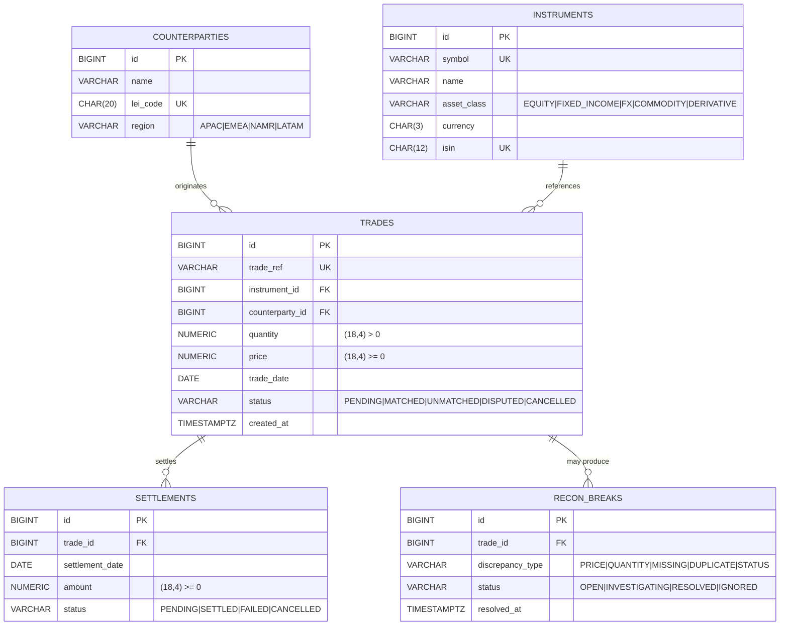

# TradeFlow — Entity Relationship Diagram (TICKET-I002)

> Replace this file with your team's ER diagram.

## Skeleton (replace with your real diagram)

## TODO(TICKET-I002)

- [ ] Replace the skeleton above with your team's accurate diagram.
- [ ] Annotate cardinalities (1:N, N:N).
- [ ] Mark optional vs mandatory fields.
- [ ] Link this from the project root `README.md`.
